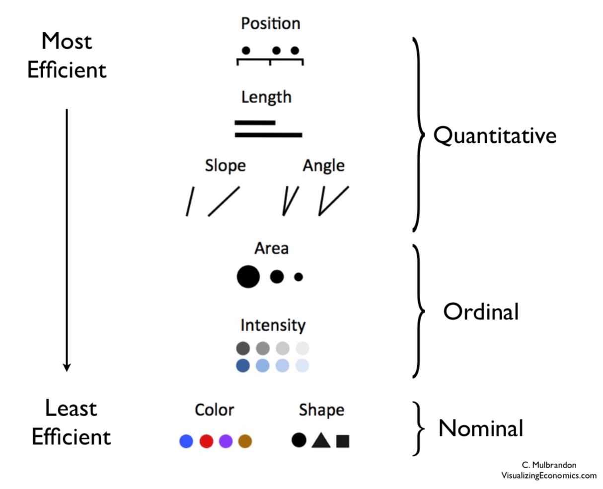
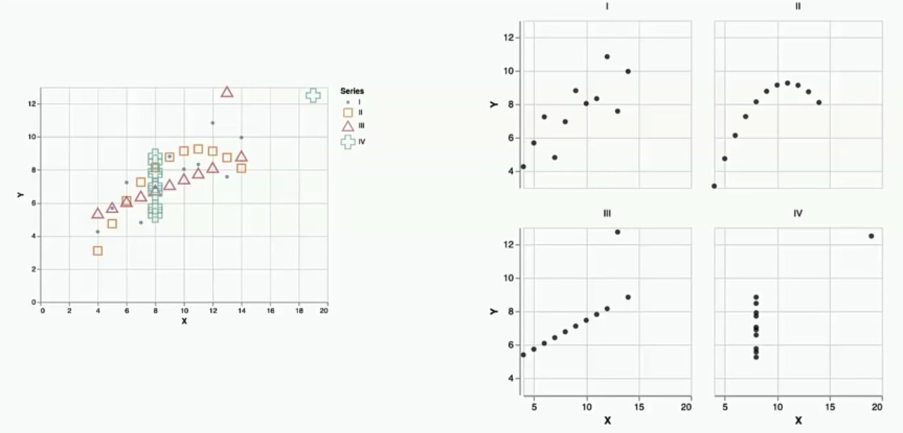
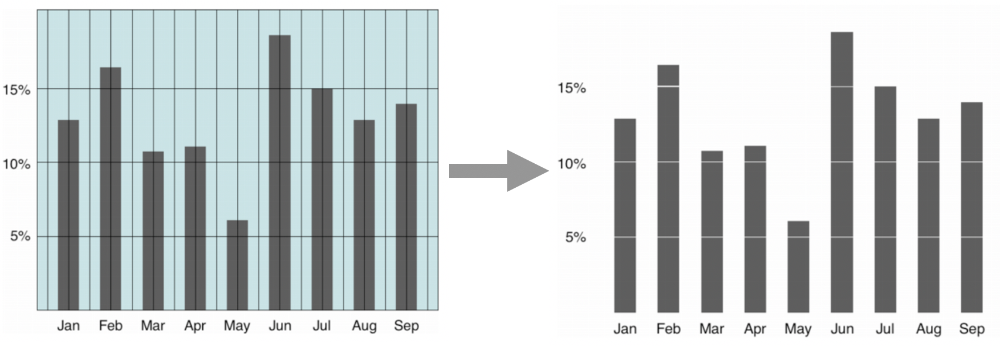

# Visualization

I really enjoyed [these slides](./data/principles_of_viz.pdf) on the principles of visualization from Saravanan Thirumuruganathan's [course on Data Mining](https://saravanan-thirumuruganathan.github.io/cse5334Spring2015/). Below my three most important take aways.

## Know efficient visualization mechanics

{: style="width:50%"}

Source: [Figure](https://paldhous.github.io/ucb/2016/dataviz/week2.html), [Research](http://courses.ischool.berkeley.edu/i247/f05/readings/Cleveland_GraphicalPerception_Science85.pdf)

## Use small multiples liberally

Small multiples means using multiple smaller charts in a figure.
Notice how the right chart is much easier to understand than the left.

{: style="width:75%"}

Source: [Jake VanderPlas 2019 Pycon Talk]()

## Maximize data to ink ratio

[Edward Tufte](https://www.edwardtufte.com/tufte/) popularized the idea of [data to ink ratio](https://infovis-wiki.net/wiki/Data-Ink_Ratio). Simply put, it implies removing as much as chart junk as possible such that only the informative parts remain.

{: style="width:75%"}
