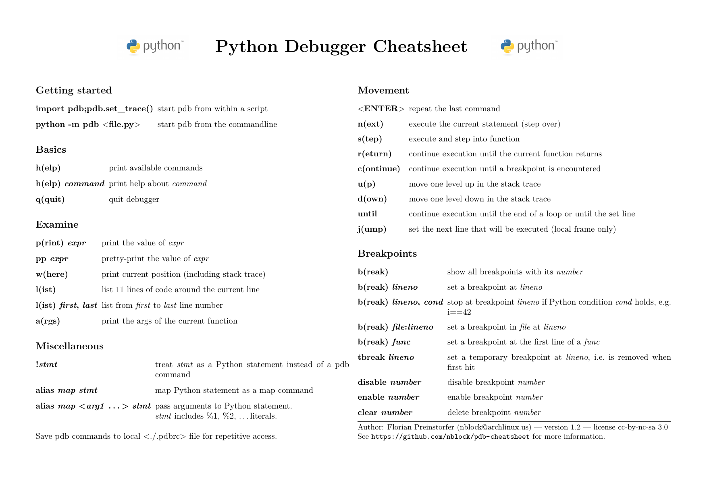

# Debugging

## pdb

Python Debugger (pdb) is easy to use, simply put `import pdb; pdb.set_trace()` in your `.py` file and run it.
[Florian Preinstorfer](https://github.com/nblock/pdb-cheatsheet) made a great cheatsheet for what to do once you're inside the debugger.

## In Jupyter Notebooks

In jupyter notebooks you can start the debugger as above, but you can also use the `%debug` magic.
It works like this:

1. Get an error in a cell
2. Run `%debug` in another cell to start the debuggre the error point of last run cell

## ipdb

The vanilla python debugger is good, but it misses some basic features such as tab completion.
Luckily there is [ipdb](https://github.com/gotcha/ipdb) which is a seamless replacement.
Simply `pip install ipdb` and set breakpoints with `import ipdb; ipdb.set_trace()`.