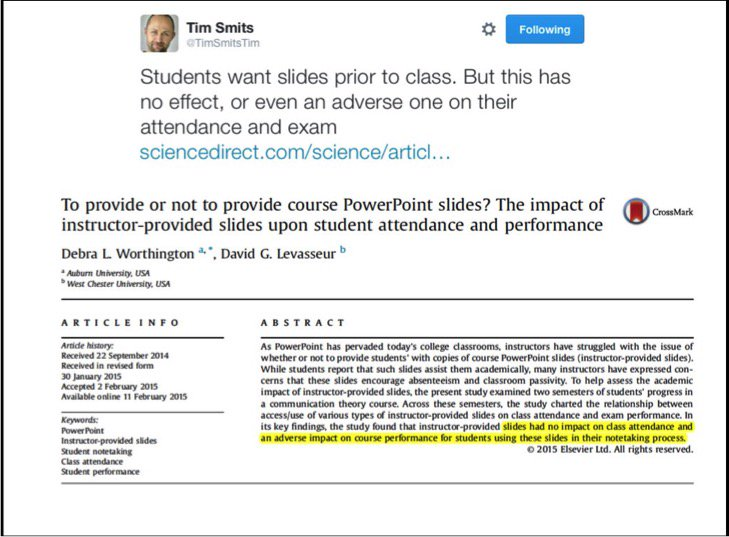
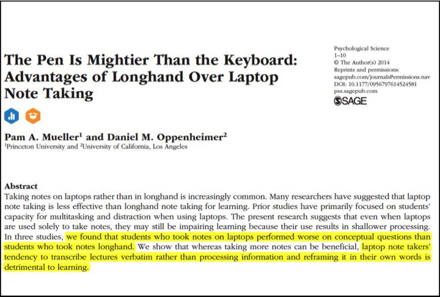
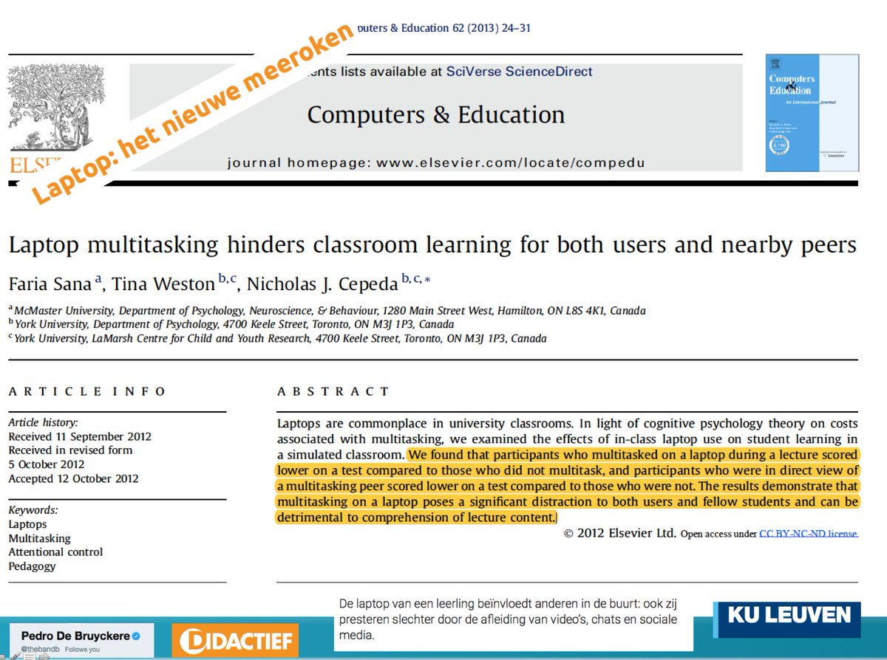
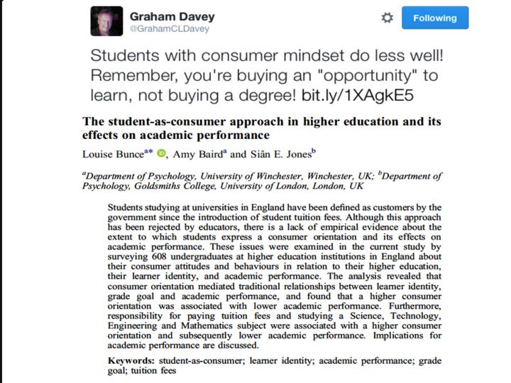
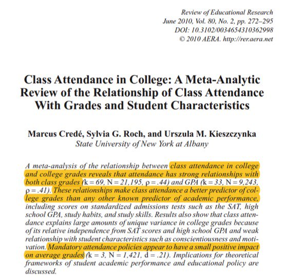
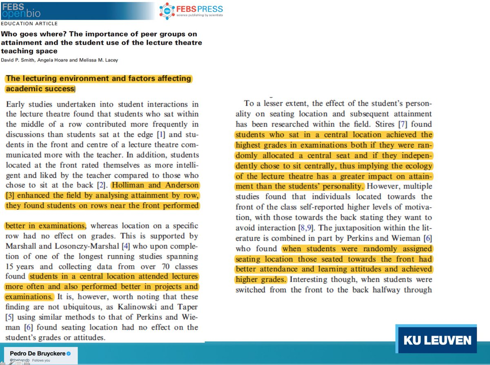

# Training

## Tips from Jeff Olson
> Don't teach chemistry; teach how to cook.
-- Jeff Olson (paraphrased)

### Prediction First Method

[Credits: Jeff Olson:](https://blog.upperlinecode.com/stop-teaching-code-a1039983b39)

1. Present a puzzle for students to solve. The puzzle is complicated, and involves all of the composing pieces you intend to teach for the day.
2. Ask students to create something based on that puzzle.
3. Show your own example of what the thing we’re doing looks like, ideally in its most perfect form.
4. Take the mental model students have built, and paste the academic vocabulary and definitions on last.


### Ask better questions

[Credits: Jeff Olson](https://blog.upperlinecode.com/de-bueller-your-coding-questions-aee06a0f5c86)

1. **Predictions** -- *Thumbs up when you have an answer:* When asking for predictions, I’ll say “thumbs up when you have your prediction ready!” Then I can call on anyone. It’s essentially a variation of cold-calling that requires all students to be ready to share without the stress of calling on someone who hasn’t finished processing yet.
2. **Explanations** -- *Think — pair — warm call:* When asking for explanations, justifications, and other more complex sense-making, it almost always works better to give students the space and privacy necessary to struggle with these concepts in small groups. Then I can eavesdrop and prepare some warm calls, being strategic about which perspectives get elevated to the whole class.
3. **Recall** -- *Think, don’t say:* When asking a recall question, I ask students hold an answer in their head. Once I know everyone is thinking of an answer, I have them chant it to me in unison.

### Students don't need simple example; they need clear ones.

* [Again credits to Jeff Olson:](https://blog.upperlinecode.com/students-dont-need-simple-examples-424bb1ceb820)

Examples:

```python
print("Hello world")
name = "Tamara"
print("Hello"+name)
```

```python
age = 15
if age >= 18:
    print("You're old enough to buy a ticket for an R-rated film.")
else:
    print(f"You'll be old enough in {18 - age} years")
```

```python
favorite_foods = ["Sushi", "Tamales", "Mofongo", "Pizza", "Chicken Tikka"]
print(favorite_foods[2])
```

```python
user1 = User("Ty", "Tdog@aol.com", 16, "Pa$$word")
user2 = User("Sarai", "SMendes@hotmail.com", 15, "Kangaroo!")
user3 = User("Osu", "Osu22@gmail.com", 12, "12345abcde")
print(user2.age)
```
```python
def get_permissions(name, age):
  permissions = ["G", "PG"]
  if age > 12:
    permissions.append("PG-13")
  if age > 17:
    permissions.append("R")
  print(f'Permissions granted for {name}')
  return permissionsuser1_permissions = get_permissions("Yessenia", 17)
user2_permissions = get_permissions("Grace", 14)print(user2_permissions)
```

## Classroom research

Credits to [Filip Raes](https://twitter.com/raziraes/status/1044536522207350785) for gathering these screenshots of research papers on classroom behavior.

I like showing use these images at the start of my trainings when I set the stage of how what they can expect from me and what I expect from them. They're part of an introduction deck I use, but attendees have asked for these images specifically so I share them here.






