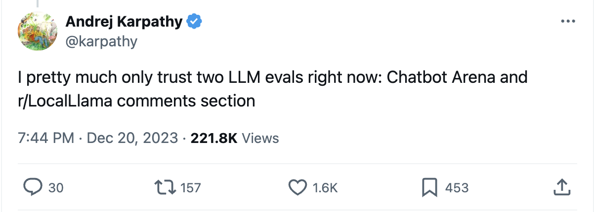
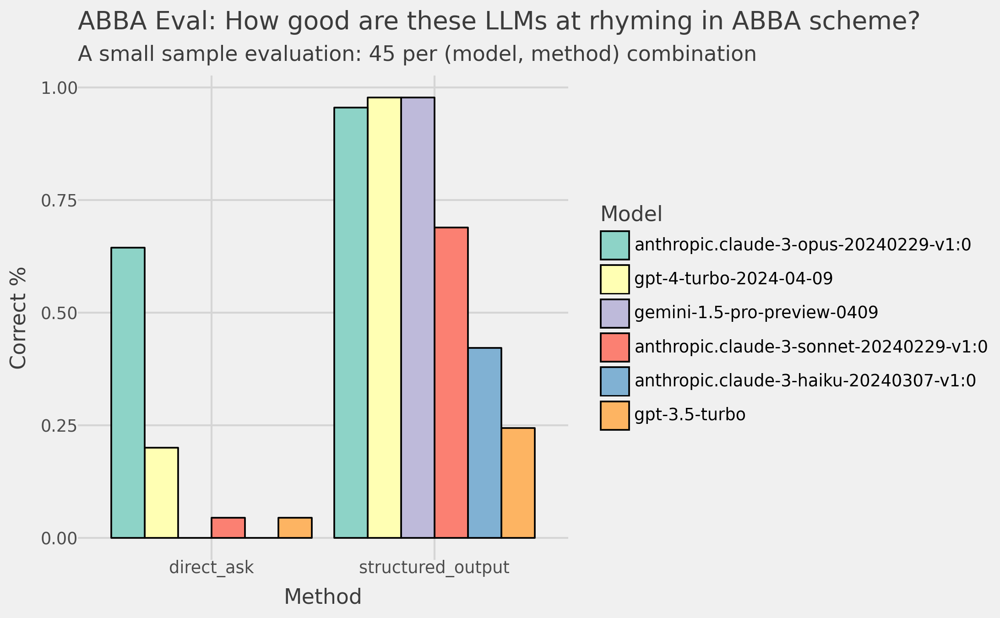
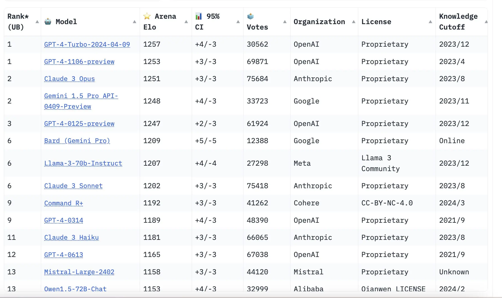

*Originally posted on [Xebia's blog](https://xebia.com/blog/lessons-learned-from-a-diy-llm-benchmark/), my employer at the time of writing.*

It's becoming common knowledge: You should not choose your LLMs based on static benchmarks.

As Andrej Karpathy, former CTO of OpenAI, once said on Twitter: "I pretty much only trust two LLM evals right now: Chatbot Arena and the r/LocalLlama comments section". Chatbot Arena is a website where you can submit a prompt, see two results, and then choose the best result. All results are then aggregated and scored. On the r/LocalLlama subreddit people discuss finetuning LLMs on custom usecases.



The lesson is: only trust people evaluating LLMs on the tasks they themselves care about.

But there's something better: evaluate LLMs yourself on tasks you care about! Then you do not only get the most relevant scoring metrics for your task. But, in the process, you will also learn a whole lot more about the problem you're actually trying to solve.

In this blogpost, I will share with you my journey into evaluating LLMs on a ridiculous task. I've been obsessed with it for almost a year: rhyming in [ABBA schema](https://en.wikipedia.org/wiki/Enclosed_rhyme). For some reason, most LLMs can't create a 4-line poem, where the first line rhymes with the last, and the second rhymes with the third.

Curious to know why this is the case? In this rest of this blogpost I will share with you:

1. Why rhyming in ABBA schema is an interesting task
2. What the results were of my analysis
3. What lessons I learned from going through this exercise

## Why is rhyming in ABBA schema an interesting task?

I've been obsessed with rhyming with AI for years. In 2019 I wrote a blogpost called ["Rhyme With AI"](https://xebia.com/blog/rhyme-with-ai/) about using BERT to make rhymes. The results were amusing then, but not impressive today.

But the task of rhyming stuck with me.

Rhyming is interesting because it's about sound, while LLMs only deal with written text. Some words look like they might rhyme, but sound different, for example, flow and cow. Other words look different, but do rhyme, for example, site and knight. On top of that, rhyming requires a bit of thinking ahead. You need to plan what word the sentence will end with before you start it. Otherwise you paint yourself into a corner.

The popular LLMs now use auto-regressive decoder transformers. These only generate one word after another. The best LLMs nowadays have no problem creating a simple four line poem in AABB schema. However, as it turns out, rhyming in ABBA schema is still something they dont do well! This was first pointed out to me by [Michiel van Rijthoven](https://www.linkedin.com/in/michiel-van-rijthoven-1617741/), and I later found that this confused more people [on reddit](https://www.reddit.com/r/ChatGPT/comments/12kqv7n/chatgpt_is_unable_to_apply_rhyming_rules/).

My hypothesis is that AABB rhyming is so common, that the instructions of ABBA are not strong enough to overcome the weight of the pull of the training data. Especially when combined with the auto-regressive architecture of most LLMs. That's why I've been testing new LLMs always with this task: how much effort does it take to get it to rhyme in ABBA schema.

So far I had been eye-balling this... but now it was time for a more structured approach.

## Evaluation results

I made a list of 45 poem topics and had the LLMs generate poems. Then I checked if they followed the ABBA pattern. In the figure below you can see my results.



The left panel shows the accuracies when I use a simple prompt (below). In this case, Claude 3 Opus leaves the other models far behind at 64% accuracy, with GPT-4 coming closest at 25%.

This is a surprising result!

```python
prompt = f"Create a 4 line poem in ABBA rhyme scheme about the following topic: {topic}. Return only the poem."
```

In many other benchmarks, Claude 3 Opus, GPT-4 and Gemini Pro 1.5, are a lot closer to each other. As you can see in the screenshot of the LMSYS Chatbot Arena leaderboard below.



But let's be honest even a 64% accuracy is not impressive on a task we as people can do quite easily.

But I had a trick up my sleeve. Which is to force the output to be according to the following schema (below). I forced the LLMs to first choose the rhyming word. And only afterwards to chose the accompanying sentence.

The change in results is impressive!

In the right pane of the figure above you can see the results. Claude 3 Opus, GPT-4, and Gemini 1.5 Pro all have >95% accuracy. And all other models see big jumps in their performance too!

```python
from pydantic import BaseModel, Field

class Poem(BaseModel):
    rhyme_word_A1: str = Field(description = "The word that sentence A1 ends with.")
    sentence_A1: str = Field(description = "The sentence that ends with the rhyme word A1.")
    rhyme_word_B1: str = Field(description = "The word that sentence B1 ends with. It SHOULD NOT rhyme with rhyme_word_A1.")
    sentence_B1: str = Field(description = "The sentence that ends with the rhyme word B1.")
    rhyme_word_B2: str = Field(description = "The word that sentence B2 ends with. It SHOULD rhyme with rhyme_word_B1. It SHOULD NOT rhyme with rhyme_word_A1.")
    sentence_B2: str = Field(description = "The sentence that ends with the rhyme word B2.")
    rhyme_word_A2: str = Field(description = "The word that sentence A2 ends with. It SHOULD rhyme with rhyme_word_A1. It SHOULD NOT rhyme with rhyme_word_B2.")
    sentence_A2: str = Field(description = "The sentence that ends with the rhyme word A2.")
```

## Lessons Learned

Ok. So far you've learned that I'm a bit obsessed with rhyming in ABBA schema. And, a structured prompt can make a big difference.

But there are some more things to take away from this exercise.

### 1. Evaluate LLMs on tasks you care about

The first lesson is that you should evaluate LLMs on tasks you care about.

My charts above show that LLM performance varies a lot by task. The differences can be much larger than you'd expect from public benchmarks.

### 2. Labeling data is a super valuable task

It is through the labeling of the data that I learned the most about the problem I was trying to solve.

For example, I saw frequently occurring mistakes such as these:

> In fields of green, the flowers bloom (A)
> 
> As rivers flow, the birds take flight (B)
> 
> The sun shines bright, dispelling gloom (B)
> 
> In nature's arms, all is right (A)

*the LLM annotated the poem with ABBA while it actually followed a different schema*

> In morning's glow, I start the grind,
> 
> A task, a purpose tightly twined.
> 
> Endless hours under ticking clock's bind,
> 
> And do it all again, tethered and resigned.

*the LLM returned a poem in AAAA schema instead of ABBA*

This gave me the idea that the LLM was painting itself into a corner. It generated the first line, part of the second, and then it got stuck. It had to generate a word that rhymed with the first line, but it had already generated part of the second line. Which was working its way to a wrong ending.

That's why I came up with the idea of forcing the LLM to first generate the rhyming word, and only afterwards generate the accompanying sentence.

### 3. A bit of clever prompting can go a long way

People like to make fun of the term prompt engineering. But honestly, as we see in this exercise, a well crafted prompt can make a huge difference.

If you're analyzing the differences in outputs from different prompts. And are doing so systematically, then I think you're doing alright.

I have a much bigger problem with people who are eye-balling it and call it a day, also called LGTM@k.

### 4. Use tools that make it easy for you to get started

Labeling doesn't have to be that hard. For this analysis I kept it simple. Here's what I used:

1. [Jupyter Notebooks](https://jupyter.org/) — to rapidly write code and evaluate results
2. [LiteLLM](https://docs.litellm.ai/docs/) — a simple wrapper around many LLM providers so I could switch out models easily
3. [Instructor](https://python.useinstructor.com) — a wrapper to force LLMs to return structured output via function calling. This output must match your pydantic schema. And it integrates well with LiteLLM
4. [Memo](https://koaning.github.io/memo/getting-started.html) — a simple decorator that logs the output of a function to a jsonl file so I could save the data
5. [PigeonXT](https://github.com/dennisbakhuis/pigeonXT) — to label the data inside my notebook

## Closing

I hope this blog gave you some insight in the importance of creating your own benchmarks. And gave you some ideas to get started. You can find the code and data on [GitHub](https://github.com/rensdimmendaal/abba_eval). If you found it useful let me know!
