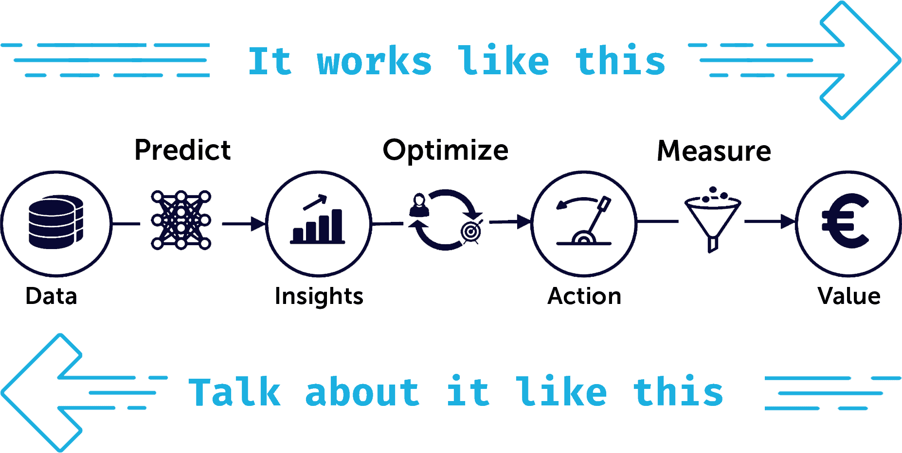

*Originally posted on [Xebia's blog](https://xebia.com/blog/how-to-explain-your-analytics-use-case-in-4-steps-without-losing-your-audience/).*

We see many data scientists struggle in explaining the use case they're working on.

And that's such a shame!

In this short post we explain the 4-step framework to connect with your audience.

## Every use case goes from data to value

1. I've been gathering data from twitter  
2. To predict what emoji goes with what text  
3. So I can recommend users what emoji's to add  
4. Which can help them lighten up their text  

It's easy to follow, right?

But that's not how you should talk about your use case!

## Here's what you should do instead:

4. People want to lighten up their text  
3. I recommend relevant emoji's to achieve that goal  
2. Those recommendations are based on the text they've written so far  
1. And are powered by publicly available texts gathered from social media  

You see what's going on right? We just flipped around the order.

## If you start from the data you will lose your audience's attention

Here's why:

- ❌ They don't care about data and models
- ❌ They don't know where you're going with this
- ❌ You've lost them by the time you get to actions and value

## But if you start with value and work your way backwards, then you can expect your audience to:

- ✅ Pay attention
- ✅ Become intrigued
- ✅ Contribute constructive feedback

## TL;DR: to explain your use case start with value and work your way backwards

1. The value you provide  
2. Actions that you optimize to provide that value  
3. Insights that you generate to optimize those actions  
4. Data that you gather to generate those insights  