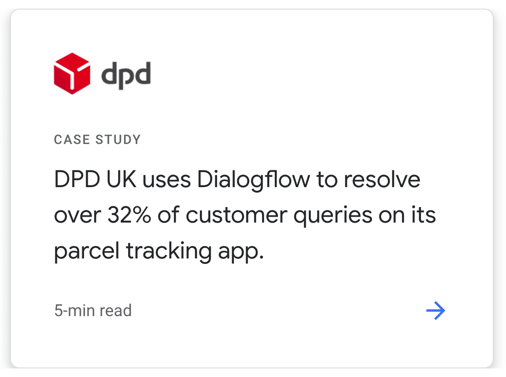
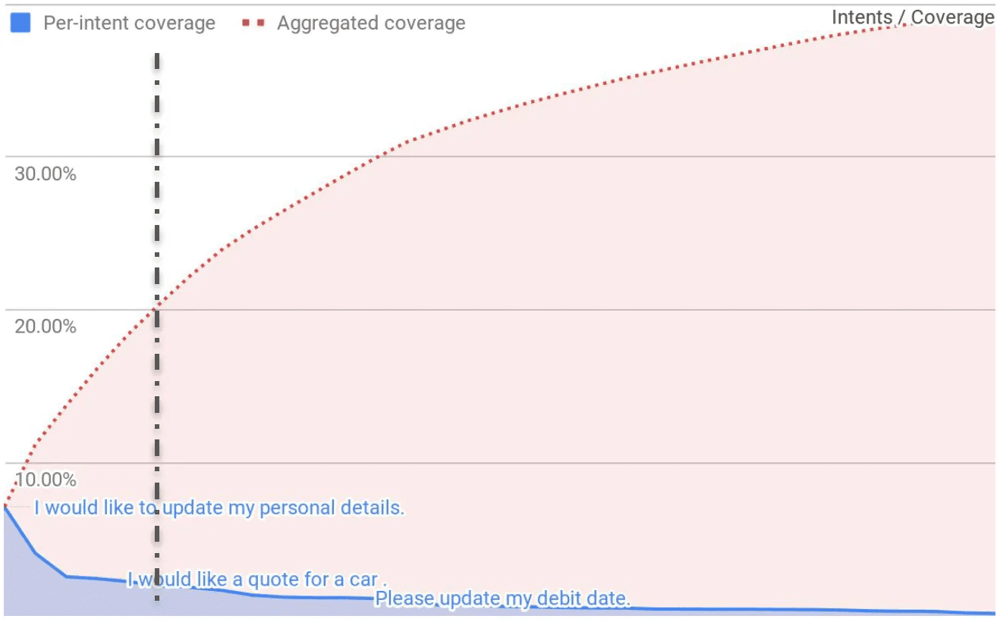
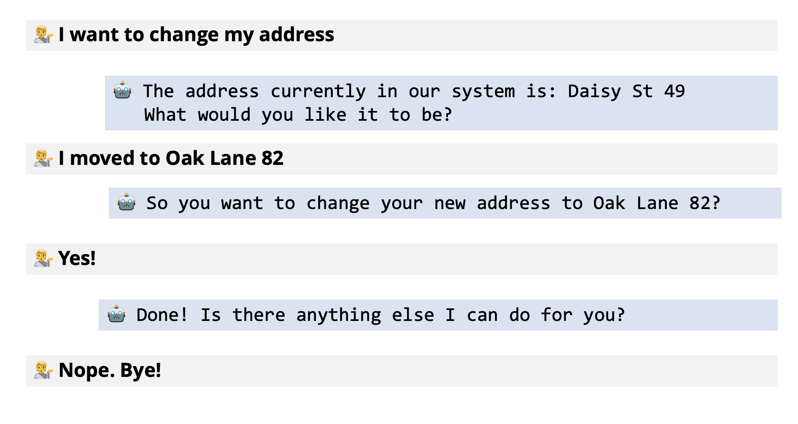
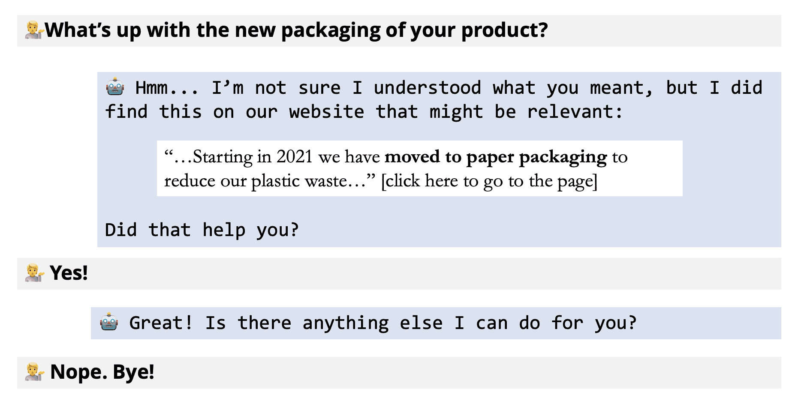

*This blog was originally posted at [Xebia.com](https://xebia.com/blog/catching-chatbots-by-the-long-tail), my employer at the time of writing.*

Have you ever had a conversation with a chatbot? Was it a positive experience? It might have been. But more likely than not it left you a bit frustrated. Chatbots try to understand your message and help you with an appropriate response. However, most of the time they're not that great yet. In a way chatbots are like baseball players.

> "Baseball is the only field of endeavor where a man can succeed three times out of ten and be considered a good performer." — Ted Williams, baseball Hall of Famer

The same holds true for chatbots. A deflection percentage of 32% [users helped by the bot without human intervention] is what google considers a success story!


*Customer Story on Google Dialogflow's website. Retrieved 20 April 2021*

As a data science consultant I've worked with multiple companies on chatbots and helped them do better. During these projects I have discovered a pattern that might help others build better chatbots too. In this article I outline three tips that should help you focus on what matters.

## The goal of chatbots

If you are building a chatbot then chances are you're trying to *deflect* users from having to speak with human customer service agents. The bot should understand the user's *intent* and send an appropriate response. This is valuable for two reasons. On the one hand because human agents are expensive. On the other hand because many intents can be resolved with a simple message, or sometimes with a programmed action.

As a side note, it's not all about cost saving. Some user intents need to be dealt with by a human agent because the stakes are too high and because customers expect a personal touch. For example when they want to upgrade to a higher service level, or if they have a serious complaint.

## The challenge of chatbots

The biggest challenge in chatbots lies in its *long tail*. Your customers probably have a few queries that occur very frequently, but the vast majority only occurs in small numbers. As a result it is labor-intensive to detect new intents, make sure the chatbot can detect them, and that the response/action is appropriate.

To illustrate consider the following chart from Eloquent Labs. The top 20% unique user intents only cover 20% of all conversations, this is what we call the "head" of the distribution. To get to the remaining 80% you need to go very far into the long tail. To have any hope of achieving 30% deflection you'll need to both be able to address the intents in the head and the ones in the tail satisfyingly.


*Eloquent Lab's intent coverage (source: a16z data moats article)*

## How to tackle the head of the distribution

Tackling the head of the intent distribution is all about *conversation design*: helping the user through a journey of achieving their goals. This is possible today with most chatbot software.

Consider the example of a user wanting to change their personal details. The chatbot may show them their current personal details, ask them which one they want to update, and then confirm the update.


*Example conversation of a frequent intent where the bot helps the user accomplish an action*

Such conversations can provide great value to your users. However, they also require a lot of work to develop. It takes user experience experts to understand the users needs. Data scientists to detect the intent based on the user's utterances. And developers to actually build the capability of solving the users problem. That's why it's only worth it to design such conversations for common intents.

## The implications of the long tail

The long tail is like a double-edged sword. First, it gets ever more expensive to discover new intents. Second the pay-off of designing a conversation with custom actions like illustrated above keeps on diminishing.

The trap of the long tail is then: trying to tackle it the same way as you tackle the head. Most of the value you try to capture with a chatbot by reducing service agent effort will be eroded by the design of ever rarer intents. So what should we do instead?

## How to catch the long tail

To deal with the long tail we need to recognize that we will not be able to explicitly model all intents nor can we keep good responses up to date for all of them. Instead, we need to leverage other tools that we have available to us.

What about search? For many companies this can be their knowledge base, or just their whole website. We could provide a search engine with Neural Q&A capabilities. These can retrieve, and highlight, the piece of the knowledge base that's most likely to answer the users's question.


*Example conversation of an infrequent, long tail, intent where the bot finds a relevant part of the knowledge base*

Search is a great alternative because it doesn't require any discovery of new intents, nor does it require the updating of new responses. In fact, if you do detect new intents in your chat histories, then you can start by adding a page to your website that addresses the issue. The chatbot will then automatically refer users to that page. Should the volumes for that intent increase enough to make it worth it to create a more refined response you can always do so later.

This approach is especially valuable if you are in a business where the nature of people's questions tends to change over time. For example if you're a grocery chain that runs many promotions. With an approach like this you just need to keep your website up to date, which it probably already is. Instead of having to design conversations that will only become irrelevant in a few weeks.

We should not expect miracles when we work with the long tail. While we might expect to deflect 80% of the 20% intents in the head of the distribution, we shouldn't be surprised if we can only deflect 20% of the 80% in the tail. But guess what? In the end both the head and the tail can contribute about equally to deflection.

```
(20% * 80%) + (80% * 20%) = 32% deflection
```

But what should we do about the remaining 68%?

## How to fail elegantly — UX meets ML

With numbers like that it's not surprising that most people are negative about their chatbot experiences.

For many predictions from the bot it could be expected that it wasn't what the user was looking for. Every bot prediction comes with a *confidence* score. If the confidence is low, then it's more likely that the response won't meet the users needs. Now what should we do when the confidence is low?

One solution is to be honest about it, and give the user the option to pick the option that is closest to what they meant, try again, or be connected with an agent. This way, even if the bot got it entirely wrong, the user won't feel that awful feeling of being completely misunderstood.


*Example conversation where the bot is confused but does not create a painful experience for the user*

There are many more UX tricks that can help improve your users experience, but this is one I've seen work well in practice.

## Conclusion

Chatbots are a fascinating field. There are clear economics that show the value that they bring, but it's also easy to fall off track and end up wasting more money than you could save. Or worse, you could lose customers because of bad experiences.

## Sources

I base my advice this article on my experience as a data science consultant. I've worked with multiple companies who build chatbots with different technologies. Furthermore, I've also interviewed software companies related to the chatbot and search chatbot domain. Finally, I've drawn inspiration from Andreessen Horowitz's, a venture capital fund, excellent blog posts, where they talk about the effect of the long tail for AI services. I recommend you give them a read if you're interested in the economics of AI.

* [The Empty Promise of Data Moats](https://a16z.com/data-network-effects-moats/)
* [The New Business of AI (and How It's Different From Traditional Software)](https://a16z.com/the-new-business-of-ai-and-how-its-different-from-traditional-software/)
* [Taming the Tail: Adventures in Improving AI Economics](https://a16z.com/taming-the-tail-adventures-in-improving-ai-economics/) 