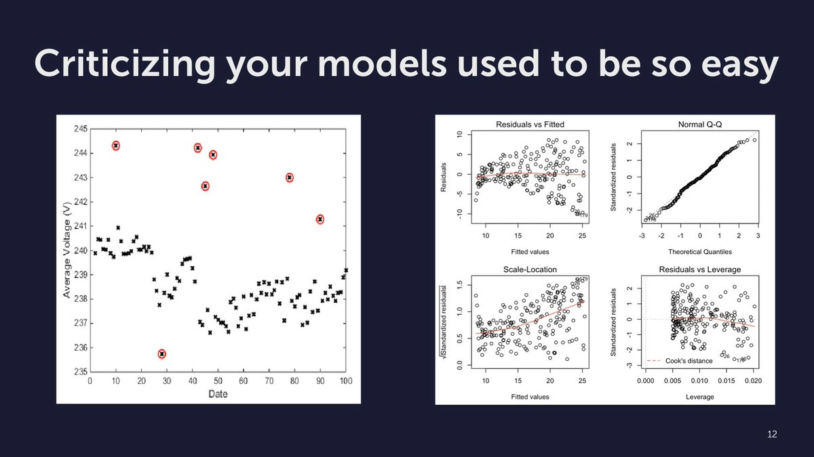
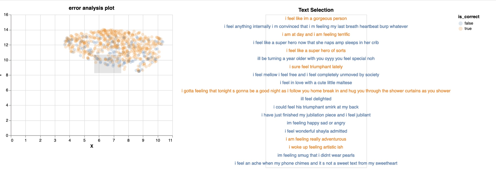

*Originally posted on [twitter](https://twitter.com/R_Dimm/status/1483182603662413827).*

Criticizing your models is an important part of modeling. 

In statistics this is well recognized.
We check things like heteroskedasticity to avoid drawing the wrong conclusions.

What do you do in machine learning?
Only check cross-validation score?

## Embedding trick

Here's one trick I apply in practice for error analysis in NLP:

1. Embed the textual input with a sentence encoder
2. Reduce to 2 dims with umap
3. Scatter plot
4. Add color to indicate if the model was right/wrong
5. Find a cluster of mistakes
6. Improve data or model

That trick helps me with debugging my data and my models. Using the [whatlies](https://github.com/koaning/whatlies) package makes it easy to apply.

But that's just a trick...

I'm looking for a structured approach to criticize blackbox models and find predictable mistakes

Who has tips for this? 🙏