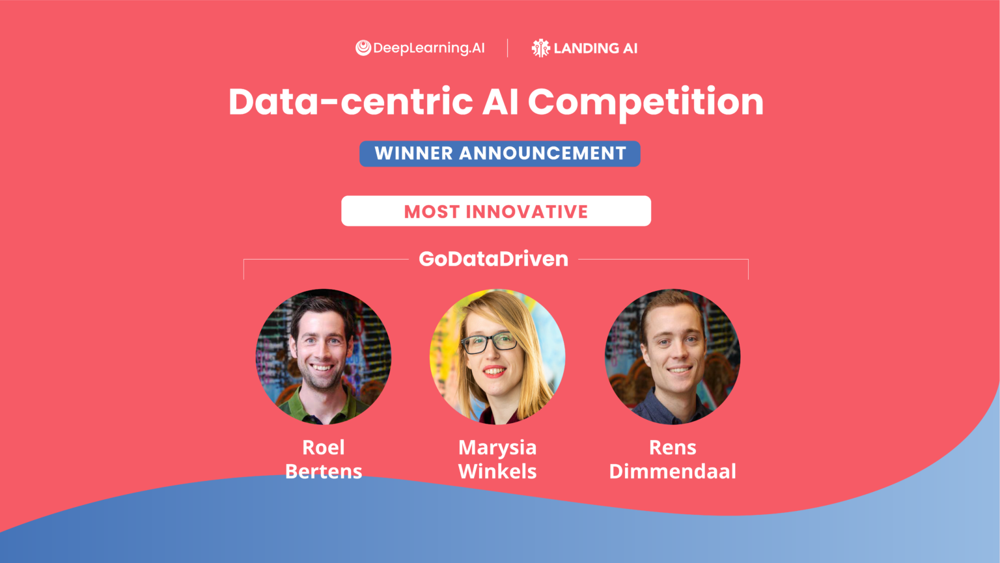

Proud to announce that my team was one of the winners in Andrew Ng's Data-Centric AI Competition! This competition focused on improving model performance by enhancing the dataset rather than changing the model itself.

To learn more about our approach and the data-centric techniques we used, check out our [detailed blog post](/posts/data-centric-ai) where we share the three key tips that helped us succeed.

We also shared a blogpost on [DeepLearning.AI](https://www.deeplearning.ai/blog/data-centric-ai-competition-godatadriven/) about our experience with the competition.