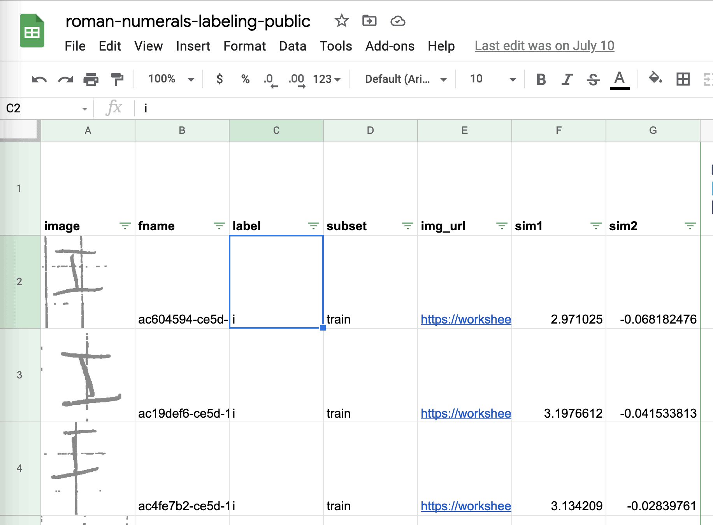
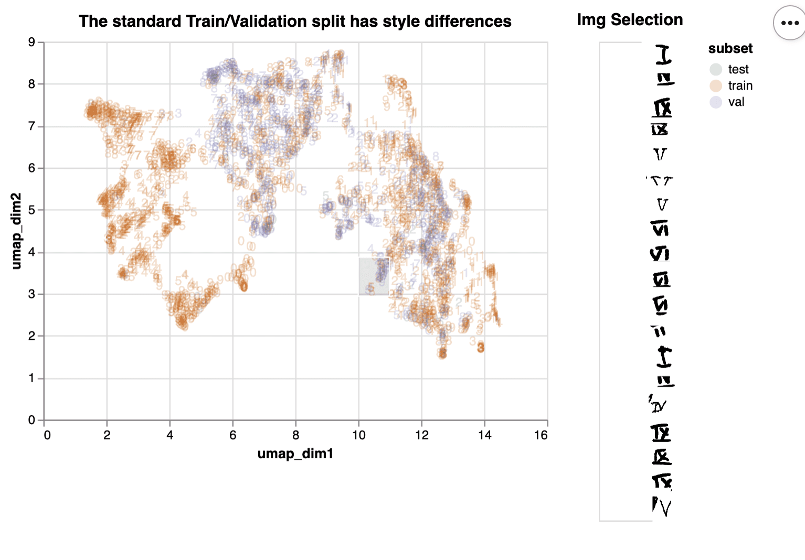
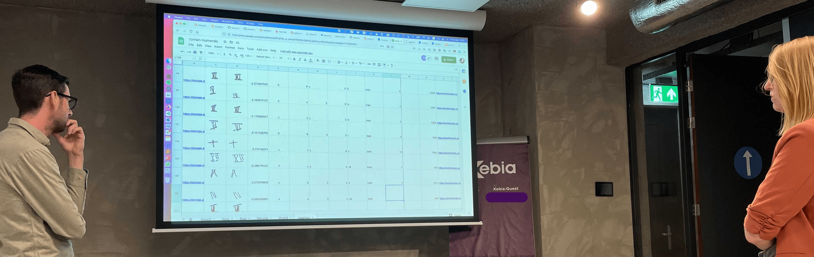
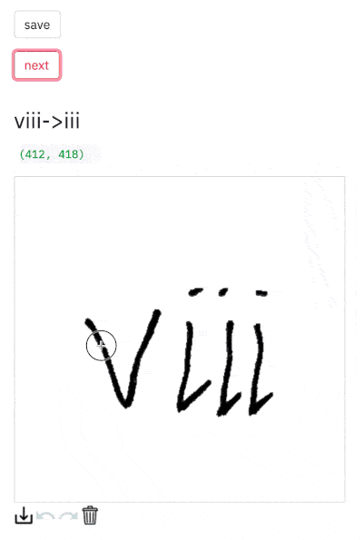
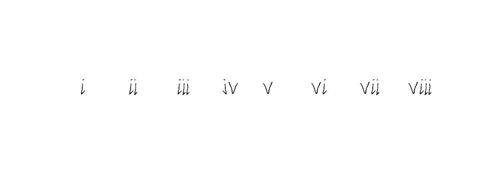

*This blog was originally posted at [Xebia.com](https://xebia.com/blog/three-tips-for-data-centric-ai-and-one-data-science-lesson/), my employer at the time of writing.*

Andrew Ng (co-founder of Coursera, Google Brain, deeplearning.ai, landing.ai) is most famous for his Machine Learning course on Coursera. It teaches the basics of machine learning, how to create models and how to use them to predict with great accuracy.

Recently, he has introduced the concept of Data-Centric AI. The idea is that rather than treating your dataset as fixed and solely focus on improving your model setup, it focuses on improving your dataset. He argues that this is often much more effective to improve your performance.

## Is there a competition?

Andrew Ng is popularizing Data-Centric AI with a competition. The idea is that you get a dataset of images of handdrawn roman numerals and a fixed model script that you're not allowed to change. You can only make changes to the dataset. You can for example add data points, change labels from existing data points, and define the train-validation split.

We have participated in this competition and are doing quite ok: we are about 2% from the top performers. We admire the effort people are putting into massaging their dataset to get to that top score.

## Three tips for Data-Centric AI

In this blog post we share some of the tricks we've used during the competition. We hope they're interesting to the other teams, but more importantly to other data practitioners. We believe they highlight how Data-Centric AI will change data science as a profession.

### Tip 1 : Use low-tech tools to get started together

We used Google Sheets to correct labels, because it allowed us to easily present all necessary information.

We used a big projector to be able to label together, which sparked some great discussions. If this was a project for a client we'd take the resulting questions to the domain experts to improve our understanding of the problem.

### Tip 2: Use embeddings to get a sense of typicality and style imbalance

First a nice trick for detecting imbalance. Take a pre-trained computer vision model, take the embeddings in the last layer, and then project them to two dimensions with UMAP. The result is likely to show any imbalance in your data.

Below we visualized these embeddings so you can explore them interactively with altair. By dragging and moving a selection window over the plot you can see what images are underneath it.

You can check out the interactive version here (warning slow to load).  
You can find as snippet with the supporting code here.

From this chart we can learn that the train/validation split is not balanced, since the validation set images are not distributed similarly to the train set (no purple on the left side).

Another way to use these embeddings is to find different roman numerals that are drawn in the same style. It can make a pretty plot, but it also helps with figuring out which images you should focus on when applying basic data augmentation tricks such as mirroring, rotation, zooming, cropping. or blurring.

### Tip 3: Use streamlit for data augmentation

We found that left-right and top-down mirroring served quite well as augmentation technique. But not all roman numerals are suited to this approach (I'm looking at you VII, VIII and IX). For that we came up with the following simple trick: we created a streamlit app with the streamlit-drawable-canvas plugin lets you easily augment images one after another.

The strategy we thought of was as follows:

1. Take an image of a roman 8: VIII
2. Erase the V, and save the III
3. Next erase the right most I, and save the II
4. Next erase the right most I, and save the I
5. Use your saved images of V, I, and II to create synthetic VI and VII

We're not hosting this app, but you can find the snippet to make this work on your own machine here

What's nice about this strategy is that you can create new data quite quickly. This is most interesting for those images that your previous model found quite hard (e.g. those VIIIs that were misclassified as VIIs). In a sense you're creating counter-factual data that helps your model see what's the difference between the two classes.

## What lesson is there to learn?

Next to these tips there is one underlying lesson to learn: communication is key. All people involved in getting model predictions to users need to communicate about the problem in order to improve the end result. Data-Centric AI shows how to do this: through the language of data. Data-Centric AI gets data scientists out of the ivory tower (or basement) where they iterate on model hyper parameters in isolation. It starts conversations: What are we seeing here? Why is this labeled that way? Why would the model make these mistakes? Questions you don't answer alone, but together with domain experts.

For good data scientists this is nothing new, but we're happy to see now there's a label for this perspective: "Data-Centric AI".

## Wrapping up

We thoroughly enjoyed participating in the Data-Centric AI competition. We wish the other competitors, chasing the last percentage points improvement, the best of luck. If any of the concepts shared here were useful to you then we would love to hear from you.

Finally, to all data scientists out there: be creative and create tools that help you have conversations about the data! Those conversations increase shared understanding and help you solve the real problem. 