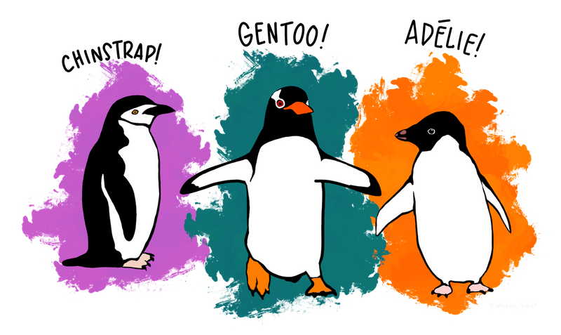
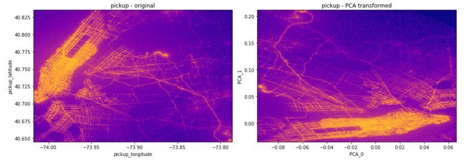
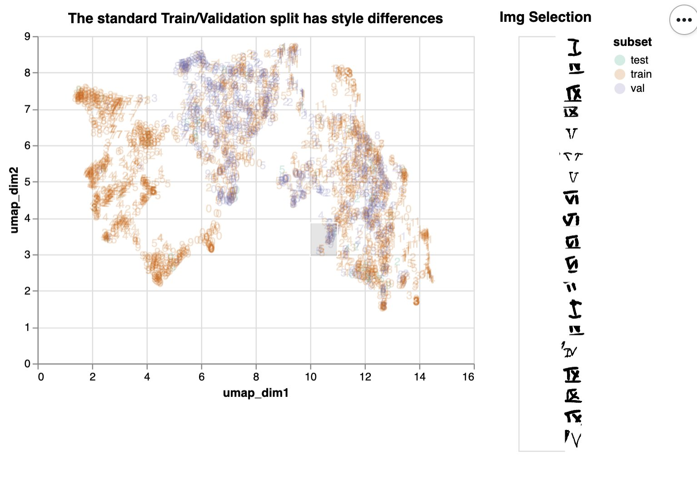
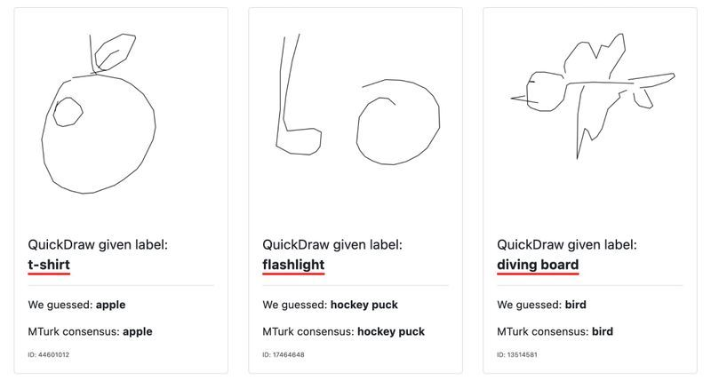
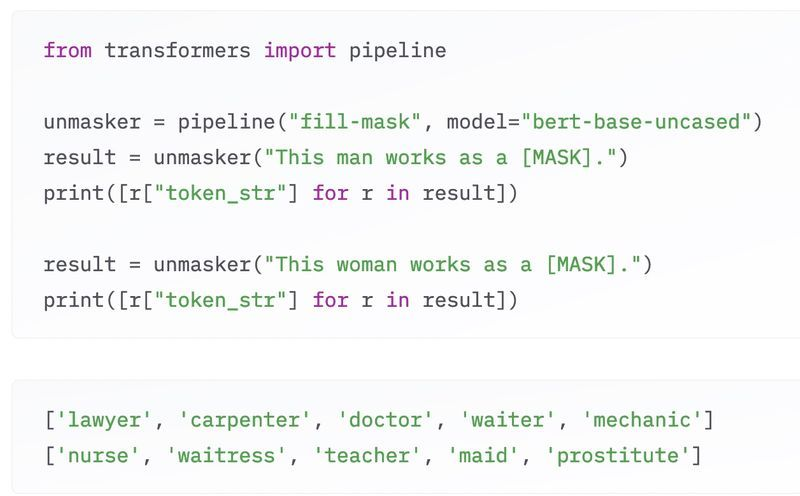

*Originally posted on [twitter](https://twitter.com/R_Dimm/status/1486952892774981633).*

> Titanic is tiring 🚢
> 
> Iris is irritating 🥀
> 
> MNIST is too easy 🥱
> 
> Boston makes me queasy 🤢

> California housing is not so bad 🏡
>
> Sentiment analysis just makes me sad 🥲
> 
> Here are the datasets that I gravitate to... 🧵 
>
> What about you? 🙌

## 

> For an introduction to ML so gently 👼
> 
> The Palmer Penguins are nice and friendly 💞
> 
> It has nice illustrations too 👩‍🎨
> 
> Meet the Chinstrap, Adelie and Gentoo 🐧

> Now if you want something a bit grander 🗽
> 
> The New York Taxi has some splendor 🚕
>
> Does this go beyond your RAM? 🙅
>
> Analyze it out-of-core if you can 🚀

> The MNIST dataset might be passe 💾
> 
> Roman numerals are drawn another way ✍️
> 
> A bit of noise and style imbalance ⚖️
> 
> Are sure to give you a nice challenge 🏆

> An important part of any ML course 👨‍🏫
> 
> Is to consider the model's source 📰
> 
> Even famous datasets contain mistakes ❎
> 
> Finding them can be a nice chase 🐆

> Some datasets we cannot see 👀
> 
> Powering models like BERT, the friend of Ernie 📺
> 
> We can question it with clever tasks 🛠
> 
> Take a look behind the word masks 🎭

> That bias is not a bug 🪳
> 
> Don't sweep it under the rug 🧹
> 
> This topic deserves a reminder 📆
> 
> These systems should be kinder 🤗

## Sources

1. Palmer Penguins: [https://allisonhorst.github.io/palmerpenguins/articles/intro.html](https://allisonhorst.github.io/palmerpenguins/articles/intro.html)
2. New York Taxi: [https://github.com/vaexio/vaex-talks/blob/master/2019-pydata-london/PyData-London-2019-vaex-EDA-ML.ipynb](https://github.com/vaexio/vaex-talks/blob/master/2019-pydata-london/PyData-London-2019-vaex-EDA-ML.ipynb)
3. Roman Numerals: [https://https-deeplearning-ai.github.io/data-centric-comp/](https://https-deeplearning-ai.github.io/data-centric-comp/)
4. Dataset Errors: [https://labelerrors.com](https://labelerrors.com)
5. Hugging Face LLM Course: [https://huggingface.co/learn/llm-course/chapter1/8?fw=pt](https://huggingface.co/learn/llm-course/chapter1/8?fw=pt)
