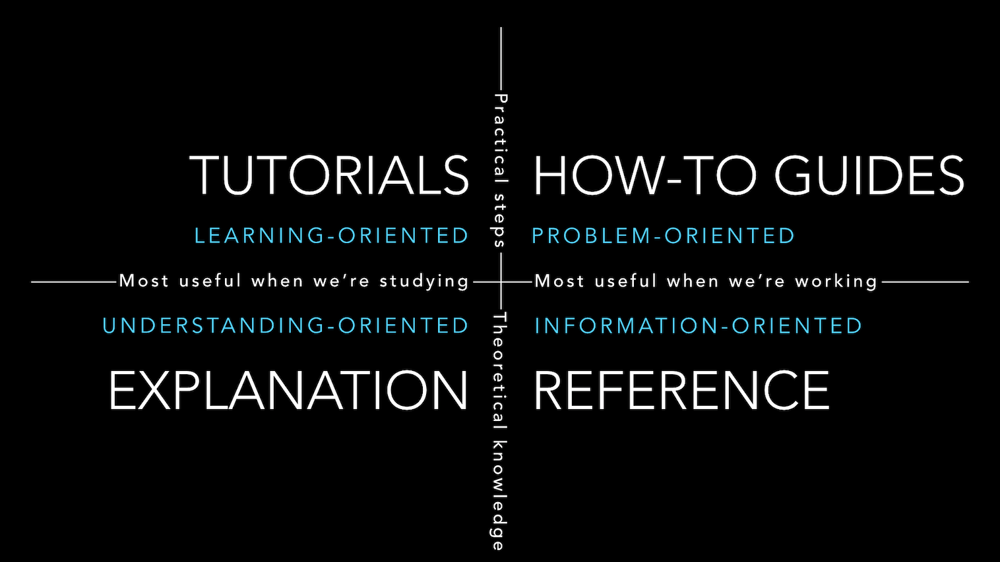

Have you ever had to work your way through bad software documentation? Couldn't find what you needed? 

Or have you postponed writing the documentation for a project because you didn't know where to start?

Well if you ever have the chance to setup documentation for a project then you should consider organizing it according to the "Divio Documentation Framework".

## These are the four sections of the framework:

1. **🐣 Tutorials.** Teach a beginner what problem your tool solves and how to get started (e.g. installation instructions and a hello world example). They're learning-oriented.
2. **🏁 How-to Guides.** Are practical steps to solving a problem. It's like a recipe in a cookbook. They're goal-oriented.
3. **💡 Explanations.** Clarify why and how things work the way they do (e.g. design decisions and their trade-offs). They're understanding-oriented.
4. **📚 Reference materials.** Only has one job: to provide facts (e.g. the api). They're information-oriented.

## These are the benefits of having clear lines between the sections in your docs:

1. The reader knows where to start reading
2. The writer knows where to start writing
3. The writer knows when to **STOP** writing

Don't understimate that last benefit! 

Because from my personal experience, not knowing when to stop writing is just as big a hurdle to sharing a piece of writing as not knowing where to start.

Read more about the framework here: https://documentation.divio.com 