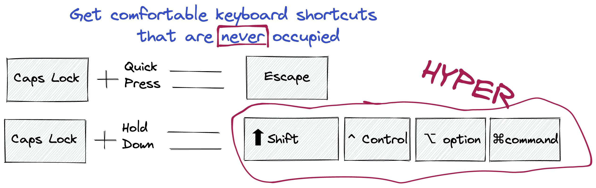

*Originally posted on [twitter](https://x.com/R_Dimm/status/1482020407951646720).*

What's the first thing you do when you get a new mac? 🧑‍💻

For me it's setup the hyper key.

It removes your caps lock functionality and gives you something much much better:

1️⃣ an escape key that's comfy for your pinky
2️⃣ a hyper key that's never occupied by other shortcuts

No other app uses these shortcuts:

⬆️ shift
^  control
⌥ option
⌘ command
+...another letter

So if you get the hyper key you get a comfortable shortcut combination that's never blocked!

And that's important, when you want to have some shortcuts available everywhere.

Keep reading for examples:

## Hyper+D for todo's in things3

hyper+d = quick entry a To Do with Things3

I really like being able to record quick todo's or notes without even leaving the "home row" of my keyboard

## Hyper+B = ScreenBrush

To draw on your screen anywhere. Super nice if you're in a video call and want to highlight or illustrate something.
(thanks for introducing me to this app Vincent Warmerdam).

## Hyper+s = SnippetsLab

to always have access to your useful text/code snippets. I use this all the time. Whether I'm writing text or code. 
In vscode, in jupyterlab, or even in slack.

## Hyper+t = toggle iterm in dropdown mode

Like this the terminal is never far away.

