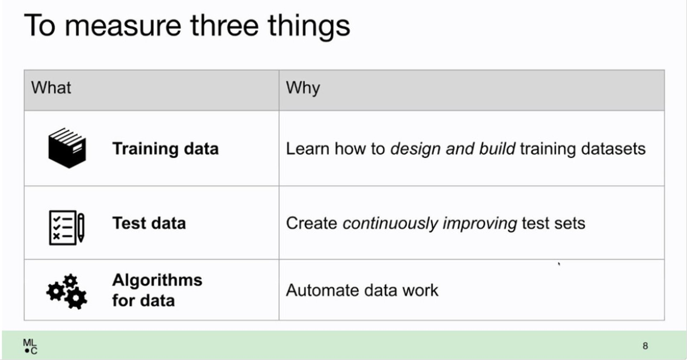
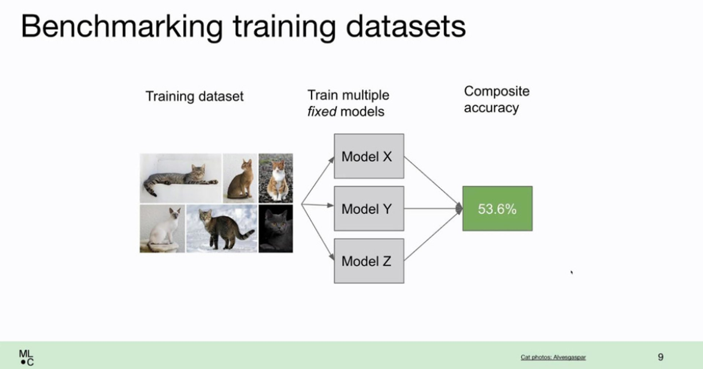
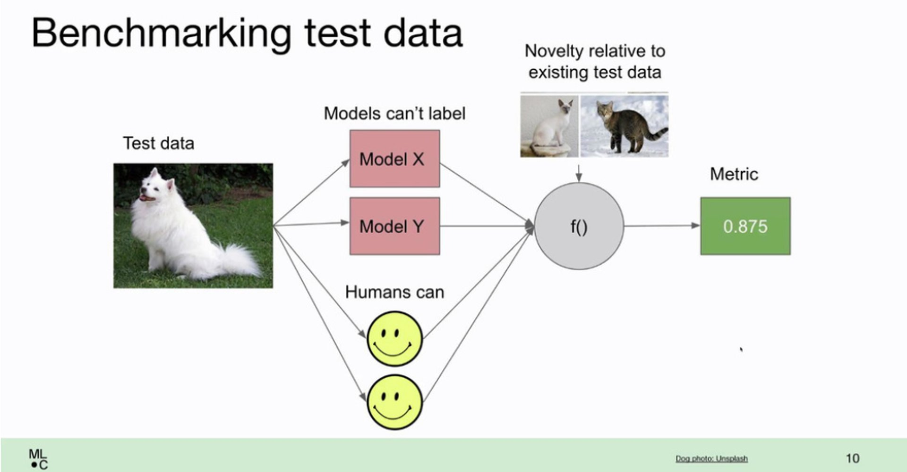
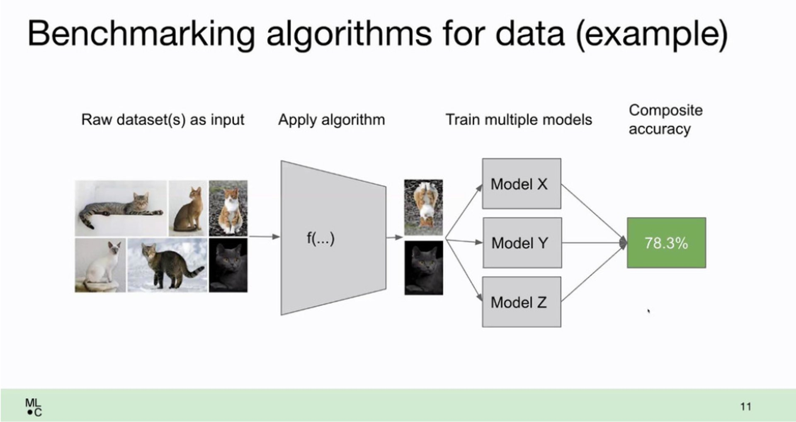
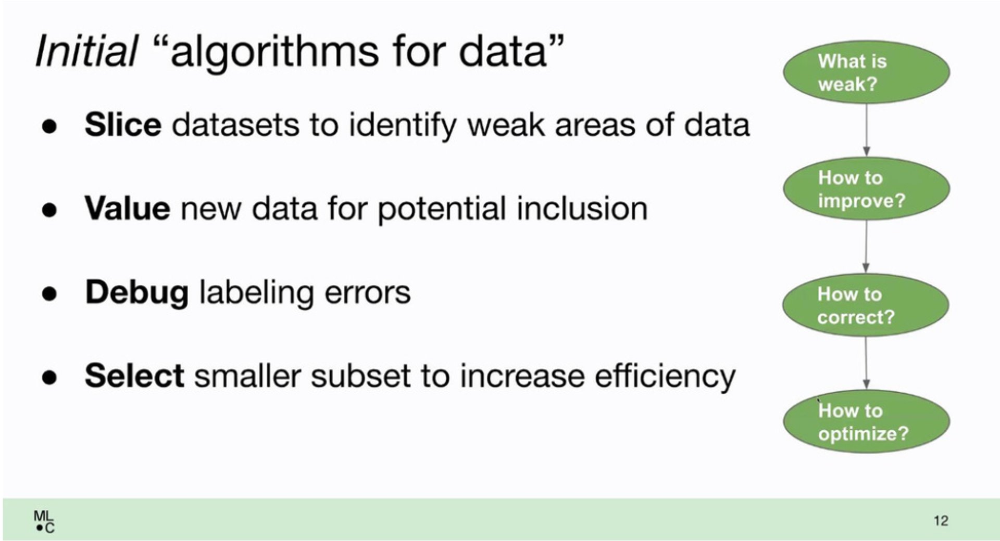

*Originally posted on [twitter](https://x.com/R_Dimm/status/1483541442526130185).*

How do you iterate on the data to improve your models?

At NeurIPS I saw a talk by Peter Mattson and Praveen Paritosh about DataPerf.

They share a framework of three types of tasks and how to benchmark them:

1. Training data
2. Test data
3. Algorithms to automate data work

## Improving your training data

Improving your training data is relatively easy. You just gather more of it. Benchmarking it is even easier. 

You fix the models and the testset and see if your additional training data yields better results.

But how to do this efficiently can be quite tricky...

## Improving your test data

Improving your test data is a bit harder. Your new test data should:

a. be hard for your current models to predict correctly
b. be easy for humans to label
c. be different from your existing test set (you don't need 100s of copies of the same difficult image)

## Algorithms to automate data work

Finally there are the algorithms to automate data work.

In the slide they show data augmentation:

For images this easy as tricks like flipping images are included in tensorflow and pytorch
For nlp there's packages like TextAttack. 

But there are more types of "algorithms to automate data work" than data augmentation:

🔪 Slice datasets to find weak clusters in your data  
⚖️ Value new data for potential inclusion  
🐞 Debug labelling errors (check DoubtLab)  
🤏 Select smaller subsets to increase model efficiency  

## Looking forward

For practitioners, I suspect, these new "algorithms to automate data work" will be especially valuable. 

Because tools scale across usecases.

There's already quite some tools available in this area. I've shared them before.

But I hope we're just at the beginning of this wave!
