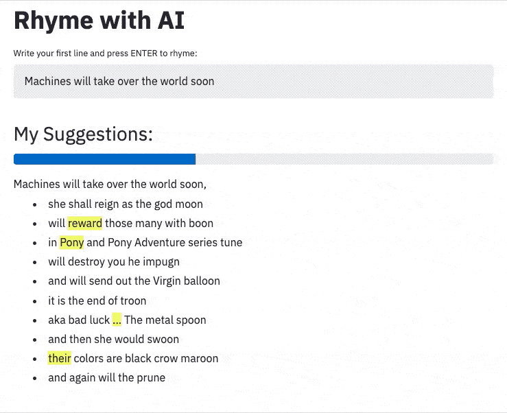
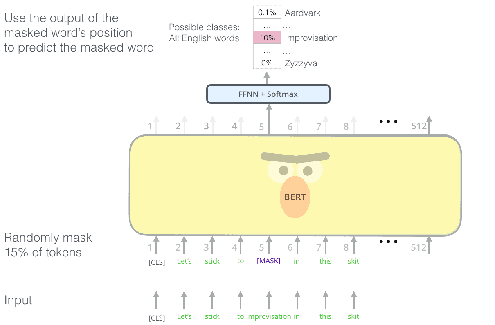

*This blog was originally posted at [Xebia.com](https://xebia.com/blog/rhyme-with-ai/), my employer at the time of writing.*

> Machines may take over the world within the year;  
> But creating rhymes instills in us the most fear!  
> Luckily, pre-trained neural networks are easy to apply.  
> With great pride we introduce our new assistant: Rhyme with AI.

## How it works

NLP's ImageNet moment may have arrived in 2018, but the ecosystem around NLP models really has matured in 2019. Many of these models (BERT, GPT-2, Transformer-XL, DistilBERT, etc.) are easy to use for your use cases. Our service uses BERT to help us with our rhymes.

Language modeling helps state-of-the-art models understand languages before solving tasks like sentiment analysis or translation. Masking, where the model tries to predict a word that is hidden from a sentence, is one of BERT's innovations. We can use it to help us rhyme by rephrasing rhyming as a task to predict missing words.

_Predicting masked tokens is one of BERT's language modelling techniques._

Our problem involves multiple masks: we know the first sentence and the last word of the second sentence. For instance:

`Machines will take over the world soon`

* `... [MASK] [MASK] [MASK] [MASK] [MASK] [MASK] [MASK] [MASK] moon`

Inspired by [BERT has a Mouth, and It Must Speak](https://arxiv.org/abs/1902.04094), we first let BERT fill in the `[MASK]`'s and then randomly sample new tokens. Some example rhymes from our model:

`Machines will take over the world soon`

* `... with gods fighting gods on the moon`
* `... as humanity rises to the full moon`
* `... with Hong Kong stuck on the moon`

This already looks pretty good, but we need a solution that people can use!

Luckily, creating an end-to-end machine learning solution is fairly simple. The [Datamuse API](https://www.datamuse.com/api/) gives back rhyme words, BERT is available via [huggingface](https://huggingface.co/) and creating an app is no sweat with [streamlit](https://streamlit.io/). Put it all together in a Docker container and a hosted solution is one command away with Google App Engine.

A few days well spent for us will hopefully save you a lot of pain. Check out our code on [GitHub](https://github.com/godatadriven/rhyme-with-ai)!