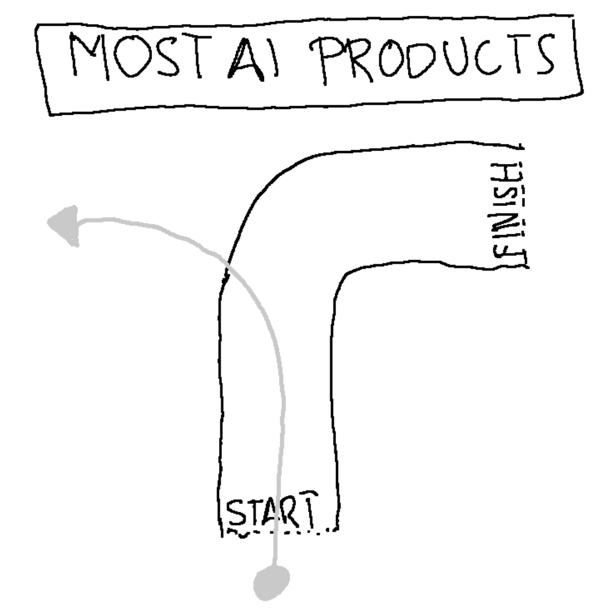
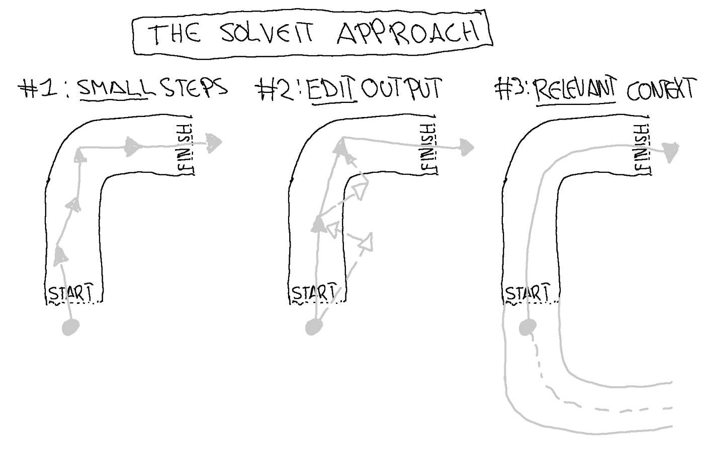
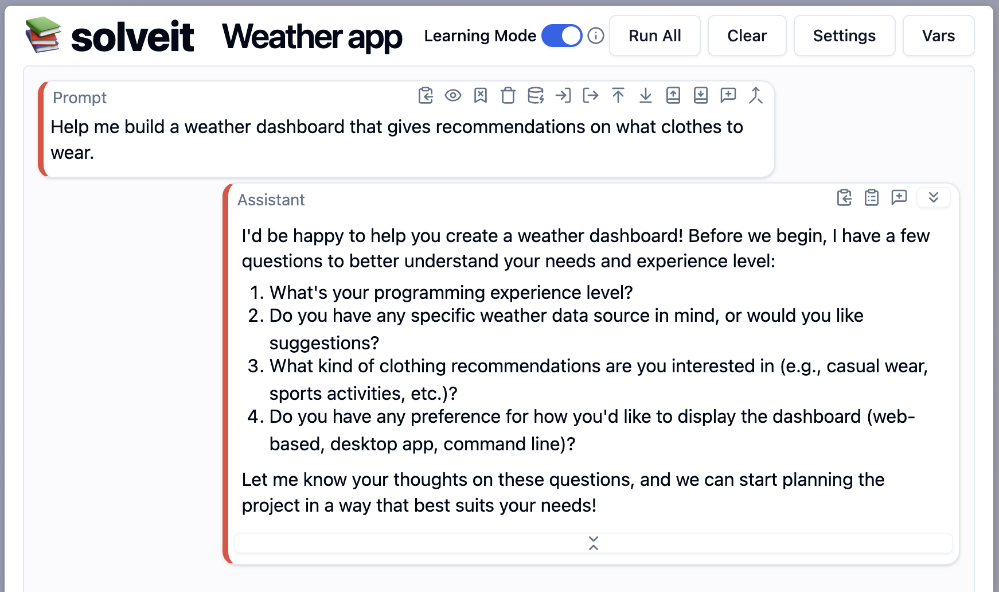
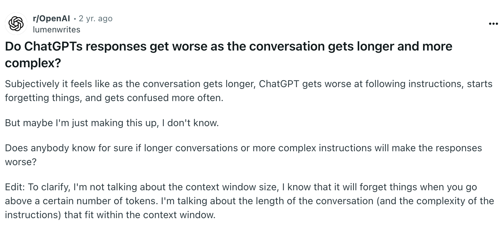
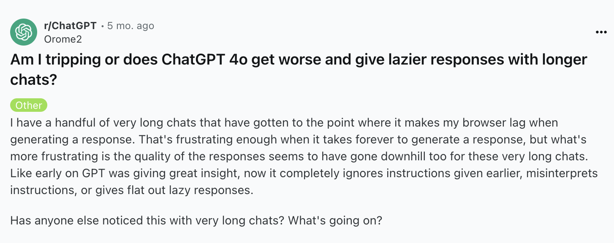
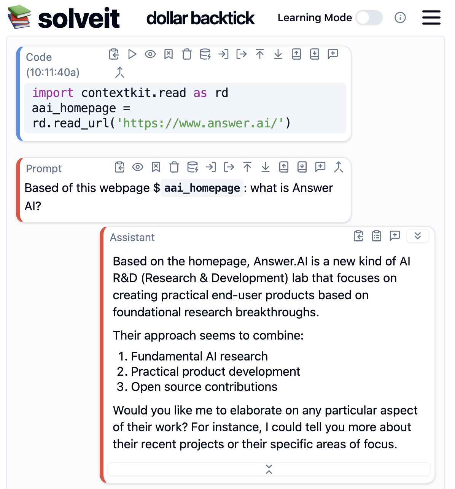

> "Here's a complete web app that does what you asked for!"

ChatGPT cheerfully responded, while presenting me with an **intimidating wall of code**. I had simply asked for help creating a small weather dashboard. At a first glance, the code looked fine. Imports, API calls, state management, and even error handling. But when I tried to run it, nothing worked. So of course, I paste the error message and ask for a fix.

> "Oh, I see the issue, here's the corrected version..."

...And two new bugs appeared. Three responses later, the code was worse than when I started. And more importantly, **I had no idea what was going on.**

To me, most AI tools feel like using a self-driving car that all of a sudden decides to drive off a cliff.



This pattern, the **"doom loop of deteriorating AI responses"**, is something I've encountered repeatedly. It's particularly frustrating because these AI tools seem so promising at first!

Enter **Solveit**, a tool designed specifically to transform these frustrations into learning experiences. In AnswerAI's "Solve It With Code" course, led by Jeremy Howard and Johno Whitaker, I learned not just how to use this tool, but the fundamental principles behind effective AI interaction that apply to working with any AI assistant.

In this post, I'll share the three key properties of LLMs that cause the doom loop, and the three techniques that transform it into a **learning loop**. It's what they've come to call **"the Solveit approach."**

**The TL;DR of this post can be summarized with this table:**


| LLM Property                              | Consequence                                | Solve It Solution                                                |
| ----------------------------------------- | ------------------------------------------ | ---------------------------------------------------------------- |
| RLHF                                      | Over eager to give long complete responses | Work in small steps, ask clarifying questions, check intermediate outputs |  
| Autoregression                            | Deterioration over time                    | Edit LLM responses, pre-fill responses, use examples |
| Flawed and outdated training data         | Hallucinations and outdated information    | Include *relevant* context |

Or if you're the visual type, with this *beautiful* illustration:



And while the course also introduced the "Solveit" tool, which is specifically designed to work with this approach, the principles apply to any AI interaction. Whether you're using ChatGPT, Claude Code, Github Copilot, Cursor, or any other AI tool. 

So even if you don't have access to Solveit, I'm sure you'll find something valuable in this post.

**Disclosure:** After the course I ended up working at AnswerAI...that's how much I love the approach!

## Property 1: RLHF creates overly eager helpers

To understand why AI assistants overwhelm us with information, we need to look at how they're trained. The key process is called Reinforcement Learning from Human Feedback (RLHF). During RLHF, human raters compare AI responses and give feedback on which responses are better.

Let's make this concrete. Imagine you're a rater comparing two responses to "How do I build a weather app?":

Response A:
```
Here's a complete solution using React and the OpenWeather API:
[100 lines of code with imports, API handling, and error handling]
```

Response B:
```
Before we start, could you tell me:
- What's your experience with web development?
- Have you chosen a weather API?
- What features do you want in your app?
```

Which would you rate as more helpful? If you're like me, then you'll rate B higher. B takes the time to check what type of answer would actually be most helpful for us. But we are not the raters in the lab! The raters probably see hundreds of these questions per day. And in that type of setting it's totally obvious they will prefer answers like A that lets them get on with their day.

The solution is simple really: instruct the LLM to help you break problems into smaller steps and embrace asking clarifying questions. This approach builds on George Pólya's problem-solving framework from "How to Solve It":

1. Understand the problem fully
2. Make a plan
3. Execute the plan step by step
4. Look back and learn

Here's a side by side comparison of Claude giving a full solution vs Solveit asking clarifying questions:

**Claude:**

<iframe width="420" height="315" src="https://www.youtube.com/embed/WDcFPo5rU_4"></iframe>

**Solveit:**



Do you see the difference? We first get asked our prior experience and preferences. Only then we start working on the actual problem...step by step.

When building our weather app, instead of copying a complete solution, we might:

- First explore available weather APIs
- Write a simple script to fetch weather data
- Build a basic UI to display temperature
- Gradually add features like forecasts or location search

Each step builds understanding, and crucially, we can verify each piece works before moving on. This approach might seem slower, but it actually saves time by preventing the frustrating cycle of debugging someone else's code without understanding it.

**The key insight is that we're working with RLHF's preference for completeness, not against it.** We're just changing what "complete" means! Not "here's everything at once", but "here's everything you need for this specific step."

## Property 2: Autoregression leads to deterioration

LLMs generate text one word at a time, with each word influenced by all previous words. This "autoregressive" property has an interesting consequence: as conversations get longer, responses tend to drift off course. What starts as clear, focused technical writing gradually becomes generic and repetitive, sometimes even devolving into clickbait-style content.

Here's are two examples of other people on the internet encountering the same issue:




This deterioration isn't random. It's the model gradually reverting to common patterns in its training data. And those patterns are mediocre, boring, and cliché. But understanding this property gives us a powerful insight: if we can shape those patterns, we can create a virtuous cycle instead of a doom loop.

### Rewriting the LLM's responses

During the course, we learned about Hamel Husain's approach to writing with AI. The end result is pretty good, for example see his [Devin analysis](https://www.answer.ai/posts/2025-01-08-devin.html). Instead of letting the AI generate long sections independently, he uses a technique of constant refinement:

1. Let the LLM generate an initial draft
2. Edit the LLM's reply to match his preferred style
3. Use that edited version as context for the next section

In step 2, we're basicaly putting words into the LLM's mouth! And that's a great way for steering an LLM into the direction we want it to go.

The only other tools than Solveit, where I've seen this is possible is code editor Zed and Google AI Studio.

### Pre-filling and Examples

Another effective technique is pre-filling responses. Instead of open-ended prompts, provide a starting point:

In Solveit, you can force the LLM to start its response however you like. (Fun fact: I actually contributed that feature. But how that happened is a story for another time!)

The pre-fill can be more effective than prompting in some cases, keeping the AI focused on your desired style and format. 

<iframe width="420" height="315" src="https://www.youtube.com/embed/lZj9cwuBQEI"></iframe>

### Create a combination of negative and positive examples

In the course, Jeremy also showed another technique:

1. Ask the LLM to generate a response
2. Reply with constructive feedback
3. Let the LLM try again
4. Edit the second, not the first, response

Now the LLM has even more context to work with: a negative example, explicit instructions, and a positive example.

**The key insight is that we're not fighting the autoregressive nature of LLMs. We're harnessing it.** By shaping the conversation through edits and examples, we provide better patterns for the model to follow. And that's a great way to avoid the doom loop.

## Property 3: LLMs are trained on flawed data

The third challenge with LLMs comes from their training. While they see a lot of data during their training, their weights only capture a lossy compressed version of it. This is especially bad for topics that are not common knowledge as it's more likely that this information is not stored accurately in the model weights. And when you ask the model questions about it, the response will contain errors.

Not only that, but information also gets out of date. "Which country won the football world cup?" depends on when you ask it after all!

These two reasons combined mean that LLMs hallucinate or provide outdated information. I don't see it as a bug, but as an essential property.

Most AI tools try to solve this with Retrieval Augmented Generation (RAG): they search through documentation or the web and include what they think is relevant. But this automated approach often misses the mark. It might pull in technically related but practically irrelevant information, or miss crucial context that you would know to include.

And that's why we need to include **relevant** context.

The Solveit approach is to take control of context management. This can be done in two different ways.

### Jeremy RAG: manually adding relevant context

In the course Jeremy showed us how he learns new things. First, he searches the web to find a relevant page of the docs. Second, the includes it in the dialogue. Third, he asks the LLM to provide a summary of the page. That way you can verify if the LLM is getting the right idea from the context you provided.

Solveit has some built in mechanisms to make this easier, like automated web search. But if you want even more control you can use the python package [contextkit](https://github.com/answerdotai/contextkit), which makes it easier to include specific pages: 

```python
# Easily load web pages
import contextkit.read as rd
aai_homepage = rd.read_url('https://www.answer.ai/')
```

```python
# But there are more helper functions:
print([o for o in dir(rd) if o.startswith('read_')])
"""
['read_dir',
 'read_file',
 'read_gdoc',
 'read_gh_file',
 'read_gh_repo',
 'read_gist',
 'read_git_path',
 'read_google_sheet',
 'read_html',
 'read_pdf',
 'read_url',
 'read_yt_transcript']
"""
```

In Solveit you can then use the dollar sign backtick syntax to reference variables containing relevant documentation, code samples, or other context. 



**The key insight is once again that we're working with the AI's properties, rather than against them.** By ensuring that only relevant context is included, we can avoid the pitfalls of LLMs that rely on incomplete, wrong, or outdated information.

## What about agentic and reasoning models? Dont they make all this obsolete?

The latest trend in LLMs are agentic and reasoning models. For example OpenAI's ["Deep Research"](https://openai.com/index/introducing-deep-research/) which autonomously searches the web for relevant information. Or Claude Code which autonomously runs terminal commands to complete tasks. These follow a multi-step chain of thought to solve a problem. And can autonomously invoke multiple tools to complete a task.

**This is the way I think about it:** 

Yes, better models will affect the frontier of what can be one-shotted. But they will not change the fact that models will keep making mistakes. 

The reason is not per se that the models cant answer the questions we ask them. But more so that when we start working on a problem, we don't even know what's the right question to ask in the first place! 

Jeremy made this point at the end of last lecture where he beautifully connected the Solveit approach to the Lean Startup methodology created by his AnswerAI co-founder Eric Ries.

> It's exactly when you're wrapping your head around a hard problem that it's most valuable to work in small steps and see intermediate outputs. Because that's where the learning happens! 
>
> Working in small steps gives you the opportunity to adapt your thinking, and refine the question you meant to ask in the first place. (paraphrased)

Or...to butcher an old proverb:

> If you want to go fast: one-shot it. 
> 
> If you want to go far: use the Solveit approach.


To learn more about Solveit, check out:

- [Check this public lesson by Jeremy and Johno](https://www.youtube.com/watch?v=DgPr3HVp0eg)
- [Follow Jeremy on X for updates on the next course](https://x.com/jeremyphoward)