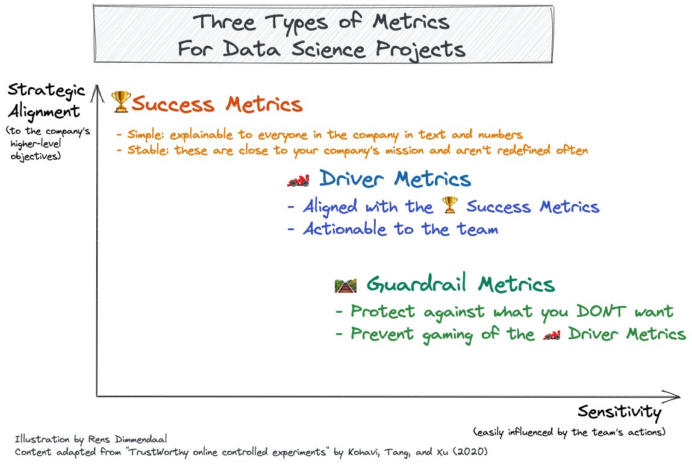

If you're working on a data science project in a professional organization you'll need to show the value you contribute. That's where metrics come in.

But choosing a metric is hard. Because there's usually multiple factors at play. I've encountered that in my daily work as a data scientist.

I've found it useful to organize metrics in three level framework. I learned about it in the book "Trustworthy Online Controlled Experiments" (Kohavi, Tang, and Xu, 2020).

I'll explain the three types of metrics below.

## 🏆 Success Metrics

These are our highest level metrics. This is what it's ultimately all about. The way your team delivers value. They're:

**Simple** explainable to everyone in the company both in text and numbers

**Stable** these are close to your company's mission and aren't redefined often

An F1 driver I guess it would be winning a race. For a streaming website it would be related to their subscription and advertisement revenue per day.

It's probably hard for your team to influence those success metrics directly. They're too high level and there's too many other factors involved. 

## 🏎 Driver Metrics

That's why we have driver metrics:

**Actionable** to the team; a couple weeks of work by the team should be able to visibly shift these metrics in the right direction

**Aligned** to the 🏆Success metrics. Improving the driver metric will also improve the success metrics.

For our F1 driver this could be average lap time. For the streaming website this could be related to the number of videos watched per day.

## 🛤 Guardrail Metrics

But we have to be careful. There could be ways in which we improve the driver metrics and still fail to achieve our success metrics!

**Protect** against what you DONT want to happen. We don't need to improve them per se, but if they get worse then that's a red flag.

**Prevent** gaming of the 🏎 Driver metrics. Look up *"Goodhart's law"* to learn more about that.

Our F1 driver might be tempted to drive recklessly to achieve top times. How would you capture that in a guardrail metric?

On the streaming website we might not want people to click on videos and then imme You could capture that with a bounce rate metric.

Heck one team's driver metric could be another's guardrail... 