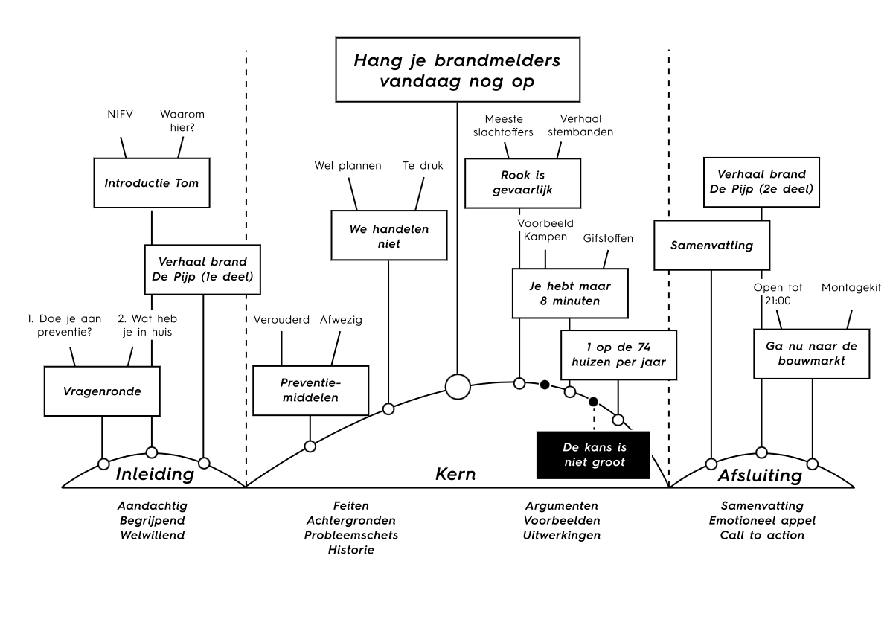

*Originally posted on [twitter](https://twitter.com/R_Dimm/status/1483934706567720960).*

I used to spend a lot of time outlining my presentations. 

But for the past two years or so I've been using this framework and it helped me focus on the content instead. It basically turns outlining into a color by numbers challenge. I learned it from a Dutch book called [Story Design](https://www.storydesign.nl/) by Farah Nobbe and Natalie Holwerda-Mieras. 

The book is only available in Dutch so I thought I'd outline the framework here.

## Intro: set the stage

**1. Attention:** Catch the audience's attention with an anecdote, fact, quote, news item, a movie, a riddle, a myth...

**2. Appeal:** Tell the audience who you are. You want the audience to like you (find common ground) and to respect your expertise (share past experience).

**3. Understanding:** Tell them what's on the agenda.

## Core: make your point

**4. Context:** To prepare your audience for your main point you need to help them understand the context. You do this by sharing history, facts, data, charts, ...etc.

**5. Main Point:** The key idea you want your audience to walk away with. You should be able to say it in one sentence.

**6. Why/How:** If you think your audience will be on board with your message straight away then you can outline next steps. Otherwise you'll need to provide arguments. Try to avoid doing both.

## End: inspire action

**7. Summarize:** Repeat the highlights of your talk so far.

**8. Emotional Appeal:** Think about what emotion you want to leave your audience. Tell a short anecdote to evoke it. It's great if this anecdote can be a callback to an earlier anecdote of your talk.

**9. Call To Action:** You created your talk because you want your audience to change their behavior. This is where you ask them explicitly the very first thing they should do to bring about this change.

That's it. You're done!

Pro tip: outline with pen and paper and not on your computer. 