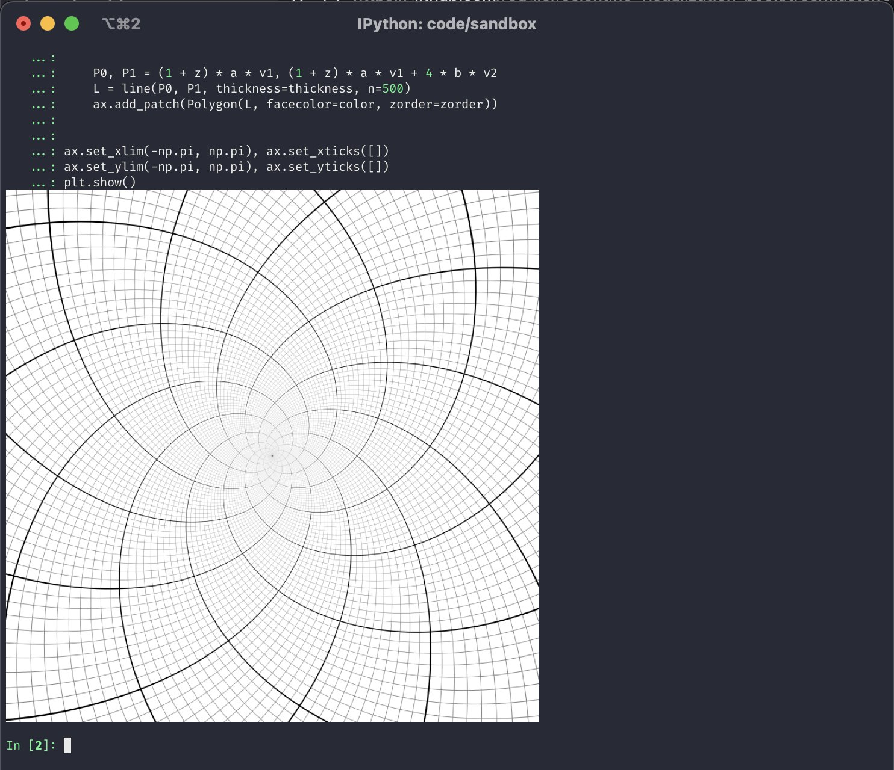
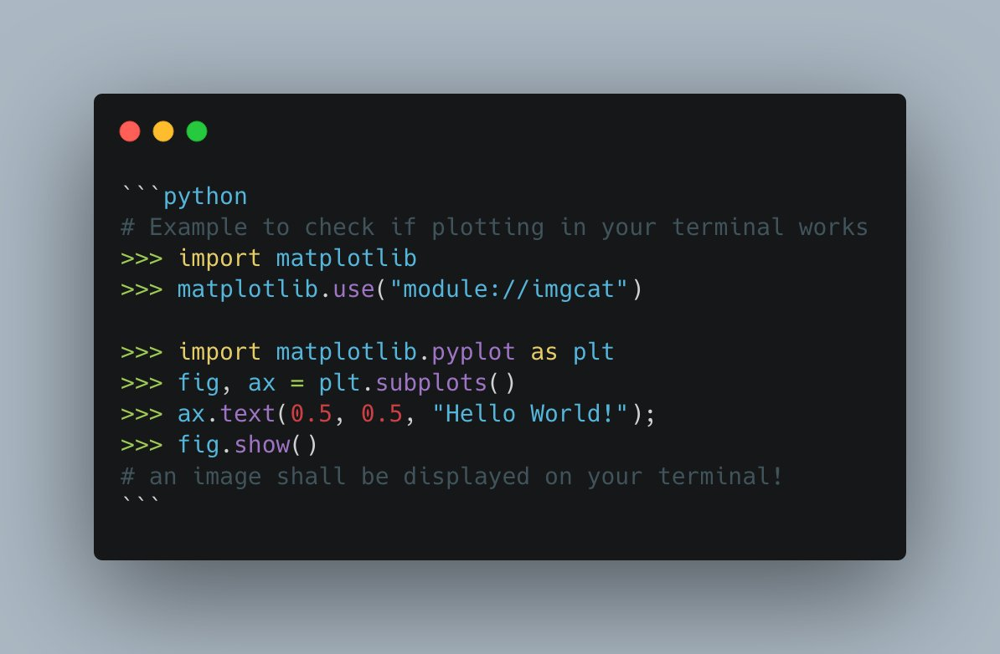
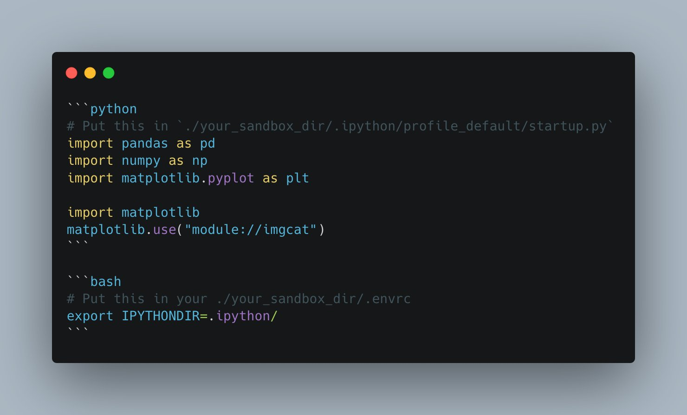

*Originally posted on [twitter](https://x.com/R_Dimm/status/1482824631908196357).*

Does anyone else use the imgcat library to show matplotlib plots directly in iTerm?



*Image credits: [Nicolas P. Rougier's](https://x.com/NPRougier) Scientific Visualization book*

Yes, plotting in Jupyter is nicer...but I think it's pretty neat that this is possible. And sometimes it's quicker too 😁

## How to set it up

Here's how I set this up in a sandbox virtualenv that I use for fooling around:

```python
pip install imgcat ipython matplotlib numpy pandas
```

Then confirm the plotting works by running this in a Python console:

```python
import matplotlib.pyplot as plt
import numpy as np
from imgcat import imgcat

# Create a simple plot
fig = plt.figure(figsize=(4, 3))
x = np.linspace(-3, 3, 100)
plt.plot(x, np.sin(x))
plt.tight_layout()

# Display directly in terminal
imgcat(fig)
```



## Making it even easier with ipython startup

Typing those import lines gets tiresome quickly. That's why I use a local ipython startup file that auto loads everything I need.

Direnv then automatically (un)loads that startup script when you leave/enter the sandbox directory.

If you don't know about direnv yet, check it out. It's pretty neat!

