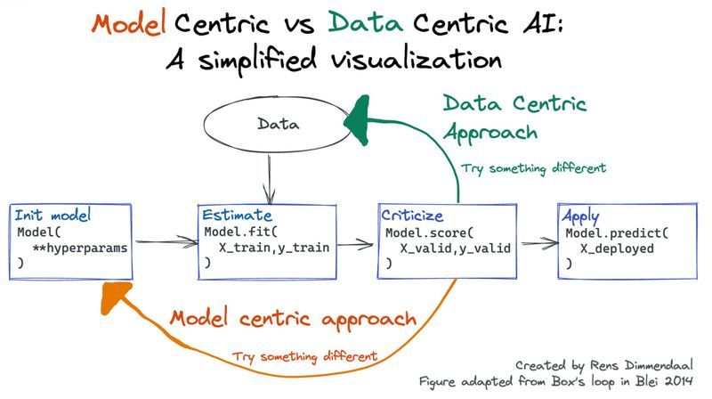

If you care about delivering value with data science you should probably care about Data-Centric AI.

Data-Centric AI is about iterating on the data instead of the model architecture to create good machine learning models.

Read the full thread on [Twitter](https://x.com/R_Dimm/status/1480817864806440960) where I explain why this approach matters for practical applications. 